# JavaScript-apnaCollege

## Introduction
- **Console** uses REPL.
- <mark>REPL</mark> stands for Read-Evaluate-Print-Loop   
- **console.log()** used to print anything in console.   
- **Enter key** means return.   
- **Ctrl + L** to clear console. (ctrl + k) for mac    
  
## Variable  
**What is a <mark>Variable</mark>?**  
A variable is a simply the name of a storage location.   
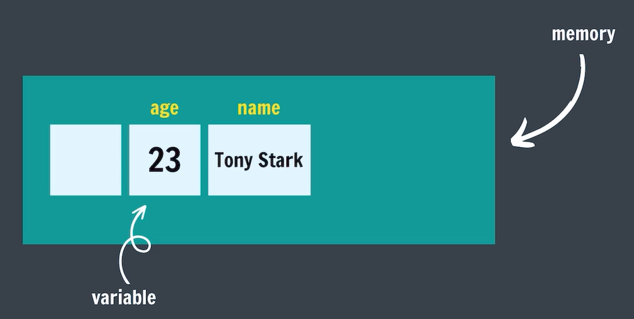  

## <mark>Data Types</mark> in JS

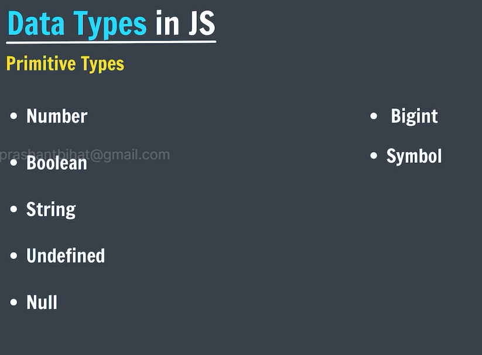   

- **typeof()** returns the datatype of a variable/value.
```js
var a = 12;
var name = 'Shiv';
console.log(typeof a);
console.log(typeof name);
```

## Numbers in JS

- Positive (12) & Negative (-6).   
- Integers (45, -50)
- Floating numbers - with decimal (4.6, -8.9).

## Operations in JS

```js
a = 20
b = 10

//addition
sum = a + b

// subtraction
diff = a - b

// multiplication
prod = a * b

// division
div = a / b

// modulo
rem = a % b

// note : a and b are here operands and +, -, *, / is operators.These are binary operator.
```

- Modulo (remainder operator)   
      12 % 5 = 2   
- Exponentiation (power operator)    
      2**3 = 8

## NaN is JS

The NaN global property is a value representing <mark>Not-A-Number</mark>.   
- **typeof NaN** is a number.   
```js

    0/0 ==> NaN
    NaN - 1 ==> NaN
    NaN * 1 ==> NaN
    NaN + NaN ==> NaN

```

## Operator Precendence
This is the general <mark>order</mark> of solving an expression.

- ( )
- **
- *,/,%  left to right
- +, -   left to right

## let keyword
Syntax of declaring variables.  let comes in 2015
```js
Syntax :: let variableName = value;
let age = 23;
let name;
name = 'Shiv';
```

## const Keyword 

values of constants can't be changed with re-assignment & they can't be re-declared.   
```js
const year = 2023;
year = 2026; //(Error)
year = year + 1; //(Error)
const pi = 3.14;
const g = 9.8;
```

## var Keyword
Old syntax of writing variables
```js
    var age = 34;
```

## Comments
```js
    // comments
```

## Assignment Operators

=, +=, -=, *=, /=

## Unary Operators

- increment (++)  
  - Pre-increment (++x) {Change, then use}
  - Post-increment (x++) {Use, then change}
- decrement (--)
  - Pre-decrement (--x) {Change, then use}
  - Post-decrement (x--) {Use, then change}

## Identifier Rules
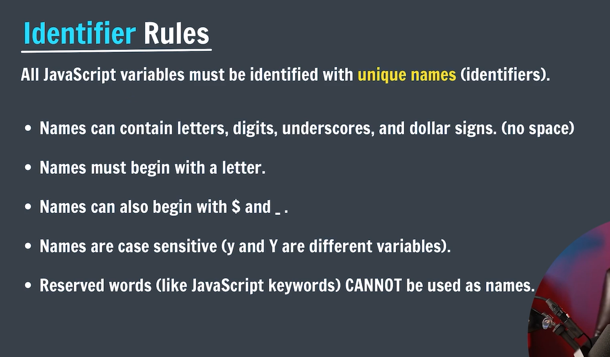   

## camelCase
Way of writing identifiers

- camelCase (JS naming convention)
- snake_case
- PascalCase

## Boolean
Boolean represent a truth value -> true or false / yes or no

```js
  let age = 23;
  let isAdult = false;
```
## What is TypeScript?
Static Typed, where JS is dynamic typed.   
- Designed by Microsoft. 

## String
Strings are <mark>text</mark> or sequence of characters.

```js
  let name = 'Shiv Singh';
  let char = 'a';
  let num = '23';
  let empty = '';
  let ssentence = 'This is "apple"';
```

## String Indices
- index means position
```js
let name = 'SHIV SINGH';
S H I V _ S I N G H
_ _ _ _ _ _ _ _ _ _
0 1 2 3 4 5 6 7 8 9
name[0] -> 'S'
name[1] -> 'H'
it is called zero based indexing.
```
- to find the length of string we use .length property.

## Concatenation
Adding strings together.

```js
"tony" + " " + "stark" = "tony stark"
"tony" + 1 = "tony1"
```

## null & undefined in JS

**undefined**
A variable that has not been assigned a value is of type undefined.

```js
let a;
console.log(a); // undefined
```

## null 
The null value represents the intentional absence of any object value.    
To be explicitly assigned.

```js
  let a = null;
  console.log(a); // null
```

## console.log()
To write (log) a message on the console.

```js
  console.log('Just Coder');// Just Coder
  console.log(1234); // 1234
  console.log(2+2); // 4
  console.log('Just','Coder', 123); // Just Coder 123
```

## Linking JS File
```js
  <script src="app.js"></script>
```

## Template Literals
They are used to add embedded expressions in a string.
back tick (` ${exp}`)
```js
  let a = 5;
  let b = 10;
  console.log(`Your pay  ${a + b} rupees`);
  // console.log('Your pay', a + b, 'rupees')
```

## Operators in JS

- Arithmetic (+, -, *, /, %, **)  
- Unary (++, --)  
- Asssignment (=, +=, -=, *=, /=, %= etc.)   
- Comparison  (<, >, <=, >=, ==, !=, ===, !==)
- Logical  

## Comparison Operators
Comparison Operator to compare 2 values. It returns boolean value.
- <
- \>
- <=
- \>=
- ==
- !=
- ===
- !==

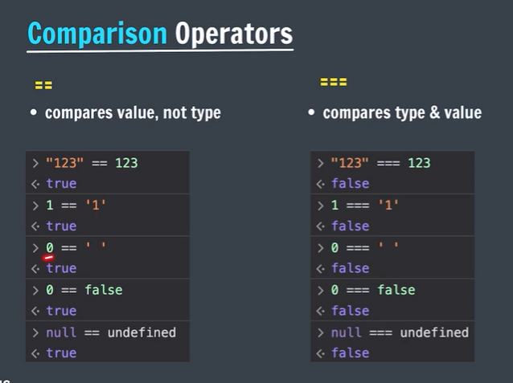  
 

**Note :** have a look on JS unicode.

## Conditional Statements :
- if-else
- nested if-else
- switch

## if Statement 
```js
  // some code before if

  if(some condition){
  // Do something
  }
  // some code after if
```
```js
  console.log('Before my if statement');
let age = 21;
if(age >= 18){
    console.log('you can vote');
    console.log('you can drive');
}
console.log('after my if statement');
```

## else if Statement

```js
  if(condition1){
    //Do Something
  }else if(condition2){
    //Do Something
  }else if(condition3){
    //Do Something
  }else{
    //Do Something
  }
```

## Nested if-else

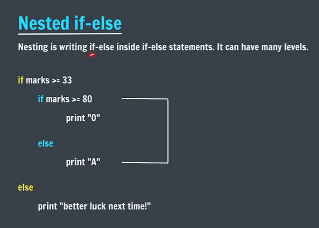   


## Logical Operators:
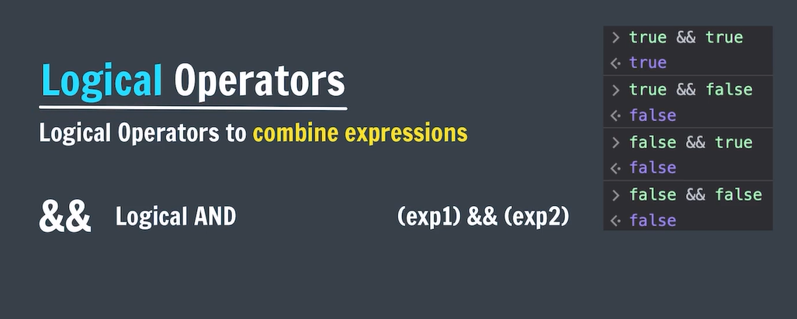  
```js
  // Logical Operators
  let marks = 86;

  if(marks >= 33 && marks >= 80){
    console.log('pass');
    console.log('A+');
  }  
```

## Logical OR (||)
```js
  let marks = 86;

  if(marks >= 80 || marks >= 33){
    console.log('pass');
  }
```
## Logical NOT
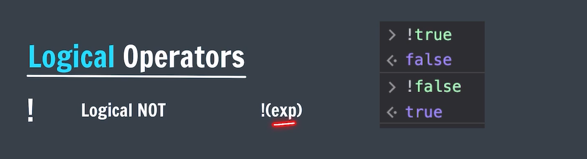  
```js
  let marks = 86;

  if(!(marks > 33)){
    console.log('pass'); 
  }
```

## Truthy & Falsy

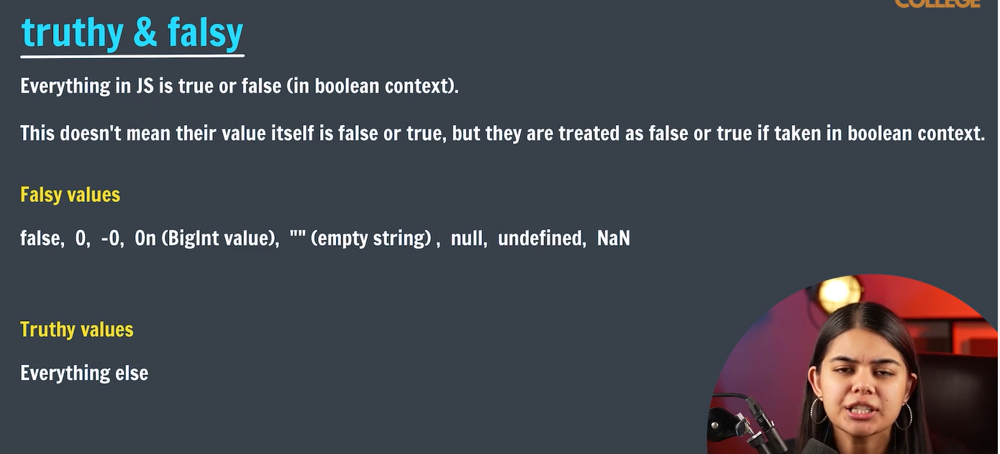  

## Switch Statement

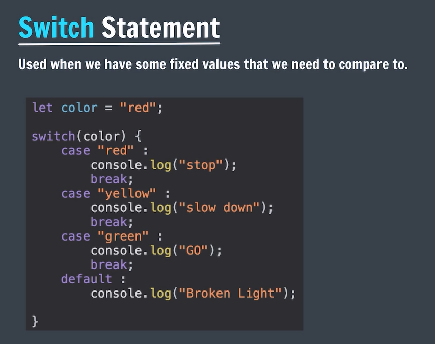  

## Alert & Prompt

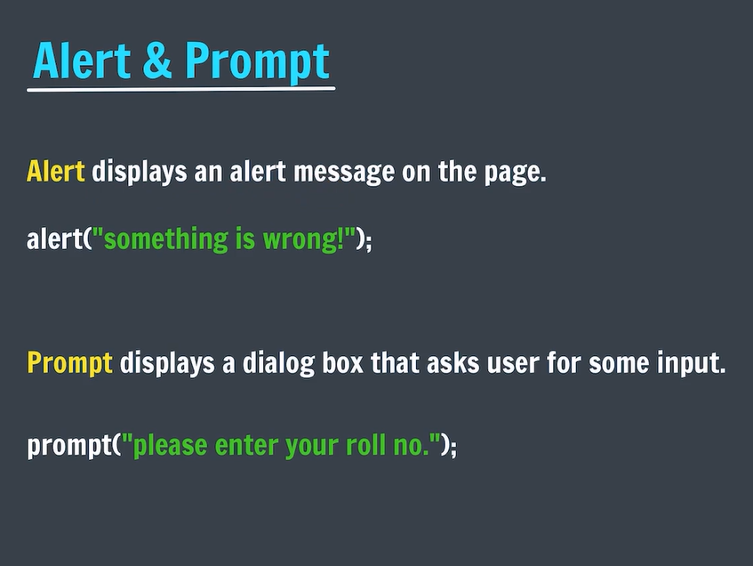  

- prompt always return a string to convert string to number use `parseInt()` method.

```js
  alert('Hello!');
  console.error('this is an error');
  console.warn('this is a warning');
  console.log('this is an log');
```

## String Methods
**Methods -** action that can perform on objects.

**Format**   
`stringName.method()`   
## trim Method
- ### trim()
- ### trimStart()
- ### trimEnd()
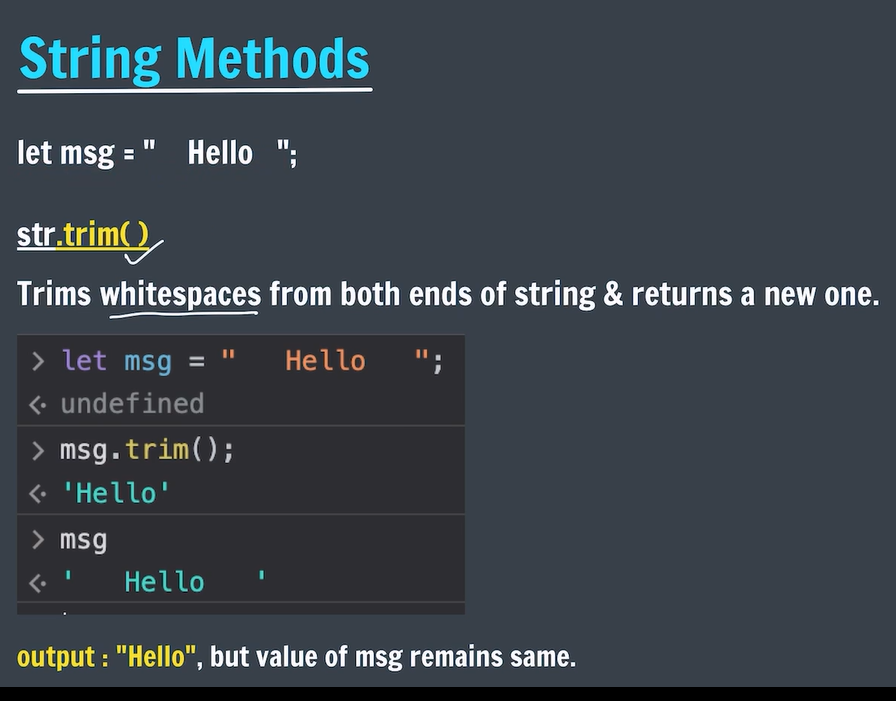  
- trim() returns a new string It does not affect orignal string because Strings in JS are Immutable.  

```js
let str = '      Hello World!     ';
console.log(str.trimStart());// 'Hello World!      '
console.log(str.trimEnd());// '     Hello World!'
console.log(str.trim()); // 'Hello World!'
```

## Strings in JS are Immutable(means cant change)
- No changes can be made to strings.
- Whenever we do try to make a change, a new string is created and old one remains same.

## Uppercase
- It converts given string in to uppercase.   
`let str = "Random String;`      
`str.toUpperCase();` // RANDOM STRING   

## Lowercase
- It converts given string in to Lowercase.   
`let str = "Random String;`      
`str.toLowerCase();` // random string

## String Methods with Arguments : 
- Argument is a some value that we pass to the method.   
**Format**   
`stringName.method(arg)`

## indexOf() 
- Returns the <mark>first index of occurence</mark> of some value in string. or gives -1 if not found.

```js
  let str = 'IloveCoding';

  str.indexOf('love'); // 1
  str.indexOf('J'); // -1(not found)
  str.indexOf('o'); // 2(only 1 index)
```

## lastIndexOf()
- Returns the <mark>last index of occurence</mark> of some value in string. or gives -1 if not found.

```js
  let str = 'IloveCoding';

  str.lastIndexOf('love'); // 1
  str.lastIndexOf('J'); // -1(not found)
  str.lastIndexOf('o'); // 2(only 1 index)
```

## Method Chaining
- Using one method after another. Order of execution will be left to right.   

`str.toUpperCase().trim()`

## slice
- Returns a part of the original string as a new string.   
- `str.slice(start, end)` end = end -1; end index not included(non-inclusive)
- `str.slice(start)` it will assume end = str.length if you pass end > length, it will take till str.length
- if you pass -ve value it will replace str.length-value for eg: length is 11 and value is -2 so It will replace -2 with 11-2 which is 9.

```js
  let str = 'IloveCoding';
  str.slice(5); // coding
  str.slice(1, 4); // lov 
  str.slice(-num) = str.slice(length-num);  
```
## subString()


## replace
- Searches a value in the string & returns a new string with the value replaced.  
- It will replace only 1st occurence.
- here string should be same "apple" and "Apple" are different

```js
  let str = "ILoveCoding";
  str.replace("Love", "do"); // IdoCoding
  str.replace("o", "x"); // ILxvecxing
```

## repeat
- Returns a string with the number of copies of a string

```js
  let str = "Mango";
  str.repeat(3); // MangoMangoMango
```

## Array (Data Structure)
- Linear collection of things.
- to find the length of the array we use `.length` property.
- index starts from 0
- element can be of different types
- typeof Array is an object

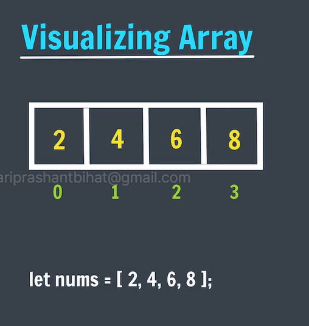  

`let arrayName = [ele1, ele2, ele3];`

```js
  let num = [1, 2, 3, 4, 5];

  console.log(num);
  console.log(num[4]);
  console.log(num.length);
  console.log(typeof num); // object
```
## Creating array

```js
  let num = [1, 2, 3, 4, 5];
  let names = ["adam", "bib", "riya"]; 
  let info = ["adam", 23, 6.1, true];  // mixed array

  // empty Array
  [] // is also an empty array
  let newArr = []; // [] -> length -> 0 --> newArr[0]--> undefined

   names[0][0] // ==> 'a'
   names[0].length // ==> 4
```

## Array Methods

### Push
- add element to the end/last index 
- It returns updated length of array
- you can pass more than one argument
```js
    let num = [1, 2, 3, 4, 5];
    console.log(num.push(7)); // 6 --> new/ updated length of array
    console.log(num); // [1, 2, 3, 4, 5, 7]
    console.log(num.push(8, 9, 11)); // 9 --> new/ updated length of array
```

### Pop
- deleted from end & return it
- it removes last element from the array 
- It returns deleted element

```js
    let num = [1, 2, 3, 4, 5];
    console.log(num.pop()); // 5 --> deleted last element
    console.log(num); // [1, 2, 3, 4]
    
```

### Unshift
- add to start
- It returns updated length of array
- you can pass more than one argument
```js
    let num = [1, 2, 3, 4, 5];
    console.log(num.unshift(7)); // 6 --> new/ updated length of array
    console.log(num); // [7, 1, 2, 3, 4, 5]
    console.log(num.unshift(8, 9, 11)); // 9 --> new/ updated length of array
    console.log(num); // [8, 9, 11, 7, 1, 2, 3,  4, 5]
```


### Shift
- delete from start & returns it
- it removes 1st element from the array 
- It returns deleted element

```js
    let num = [1, 2, 3, 4, 5];
    console.log(num.shift()); // 4 --> deleted last element
    console.log(num); // [2, 3, 4, 5]
    
```

## Array Methods
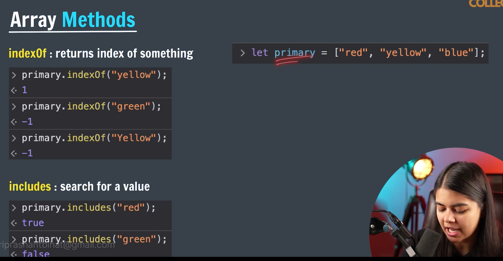    
 
- all arguments are case sensitive.

## Concatination & Reverse
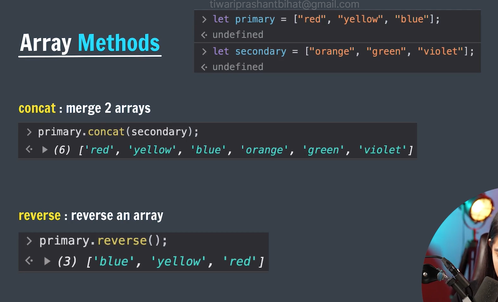 
- If you want to concat or merge to arrays so we use **concat()** method. 
- This method basically merge two arrays and return a new array. It does not manipulate orignal array.
- **Syntax** - 
- `array1.concat(array2);`
- ```js
    let arr1 = [1, 2, 3, 4];
    let arr2 = [5, 6, 7, 8];

    let arr3 = arr1.concat(arr2);
    console.log(arr3);
    console.log(arr2.concat(arr1)); // order matters here
```

- If you want to reverse an array, so we use **reverse()** method. 
- This method basically reverse the orignal array and return reversed 
  array.
- **Syntax** - 
- `array1.reverse();`
- ```js
    let arr1 = [1, 2, 3, 4];
    let arr3 = arr1.reverse();
    console.log(arr3);
    console.log(arr1); 
```


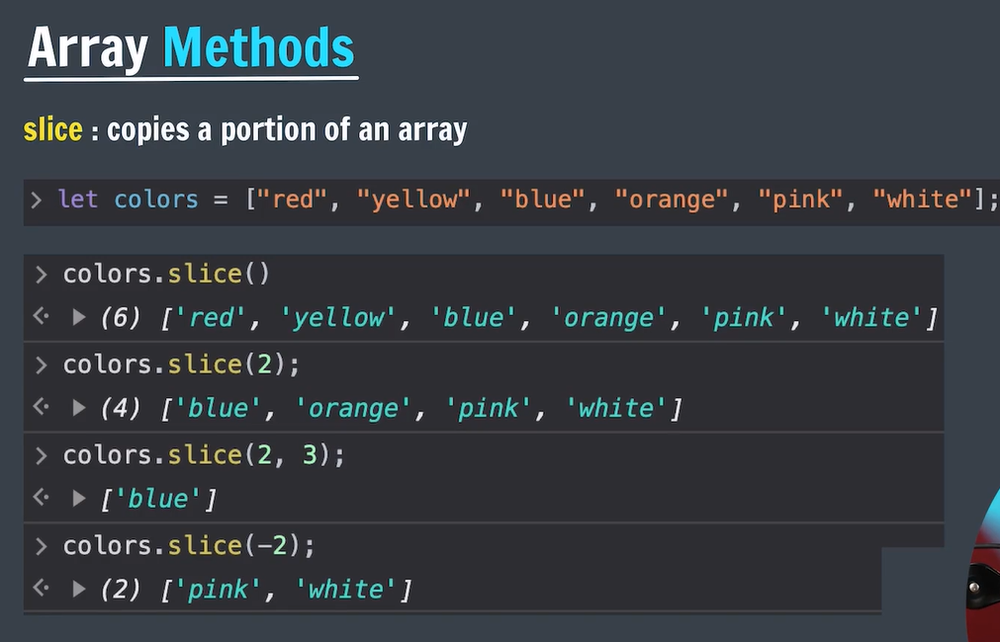

- `slice yaani tukda`
- It returns copy of a particular portion of an array as a new array.
- **syntax** - `arr.slice(startIndex, endIndex)`
- `endIndex` is exclusive that means we do not include inding index. `endIndex-1`
- arguments are optional here.
- I you pass invalid arguments (like you have an array of length 3 and you are passing 5) here it will return an empty array `[]`.
- `console.log(colors.slice(6)); // []`
```js
  let colors = ['red', 'yellow', 'blue', 'orange', 'pink', 'white']; 

  console.log(colors.slice());
  console.log(colors.slice(2));
  console.log(colors.slice(2, 3));
  console.log(colors.slice(-2)); // length - 2
  console.log(colors.slice(5));
```

## splice Method
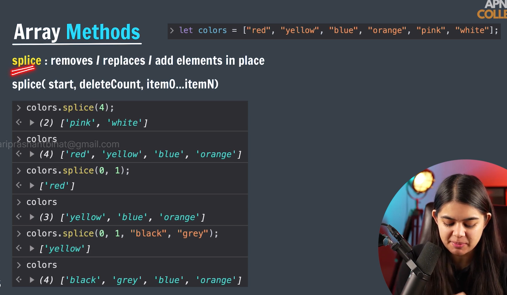 

- here we pass only startIndex not endEndIndex.
- delete count is optional you can write 0 here.
- splice modifies orignal array and returns an array.
- if we pass only starting index it will work same as slice(). refer eg1 in image.


## sort Method
- It sorts an array.
- `arr.sort()`
- for string it works very well but in case of numbers it doesn't.
- `let marks = [99, 89, 67, 42, 100];
console.log(marks.sort()); // [ 100, 42, 67, 89, 99 ]`
- It happens because it converst array elements into string first and after converting starts sorting.
- `arr.sort((a,b) => a-b)` ascending
- `arr.sort((a,b) => b-a)` descending

```js
let colors = ['red', 'yellow', 'blue', 'orange', 'pink', 'white', 'black']; 
console.log(colors.sort()); // [
  'black',  'blue',
  'orange', 'pink',
  'red',    'white',
  'yellow'
]

let marks = [99, 89, 67, 42, 100];
console.log(marks.sort()); // [ 100, 42, 67, 89, 99 ]
```

## Array References 
- Reference means adress in memory.
```js
console.log('name' == 'name'); // true
console.log('name' === 'name'); // true
console.log([1] == [1]); // false
console.log([1] === [1]); // false
console.log([] === []); // false
``` 
- when array created in memory a refrence variable created.
- `let num = [1, 2, 3]` num store address of array not actual array
```js
  arr1 = [1];
  arr2 = [1];
  arr1 === arr2; // false because both arr1 and arr2 are storing different memory locations.
```
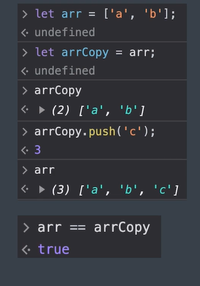 
- here in the image arr is storing address of array and we assined arr to arrCopy so now arrCopy is also containing the same address. that's why when we push 'c' in arrCopy , arr will also update because both variable are reffering to the same array.

```js
  let arr = ['a', 'b', 'c'];
  let arrCopy = arr;
  console.log(arrCopy === arr ); // true

  arrCopy.push('d');
  console.log(arrCopy);
  console.log(arr);
```

## Constant Arrays :
```js
t a = 5;
 a = a+ 5;
 console.log(a);

const b = 5;
b = b+ 5;
console.log(b); // error : TypeError: Assignment to constant variable.

// butttttt.....
```
- when we make an array constant we can perform operations on the elements of that array(like we can increase length of that array) but we can not completely convert in to new array.

```js
  // we can do
  let arr = [1, 2, 3];
  arr.push(4);

  // we can not do

  arr = [5, 4, 6, 7]; // error : TypeError: Assignment to constant variable.
  // when we are making arr constant that's not mean that we are making array constant, it simply means we are making constant address of that array.after making arr constant address will be constant.

  let marks = [99, 89];
  arr = marks; // error TypeError: Assignment to constant variable.
```

## Nested Arrays :
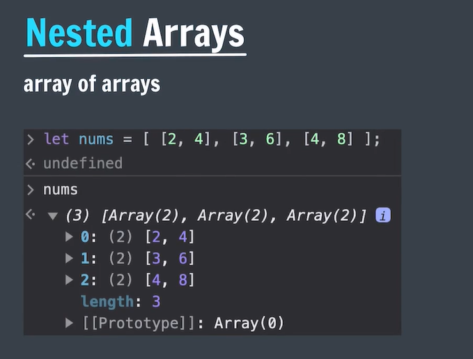  

- here length of nums is 3.
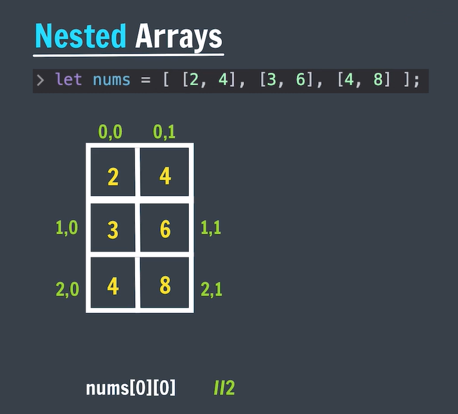 
- `arr[row][column]`
- nums[1][2]; // undefined

- To print object in the table form
```js
 const ticTac = [ ['X', null, 'O'], [null, 'X', null], ['O', null, 'X']];
 console.table(ticTac);
┌─────────┬──────┬──────┬──────┐
│ (index) │  0   │  1   │  2   │
├─────────┼──────┼──────┼──────┤
│    0    │ 'X'  │ null │ 'O'  │
│    1    │ null │ 'X'  │ null │
│    2    │ 'O'  │ null │ 'X'  │
└─────────┴──────┴──────┴──────┘

// Important
ticTac[0].splice(1, 1, 'O');
console.log(ticTac);
 console.table(ticTac);

┌─────────┬──────┬──────┬──────┐
│ (index) │  0   │  1   │  2   │
├─────────┼──────┼──────┼──────┤
│    0    │ 'X'  │ 'O'  │ 'O'  │
│    1    │ null │ 'X'  │ null │
│    2    │ 'O'  │ null │ 'X'  │
└─────────┴──────┴──────┴──────┘
```


# Loops
- used to iterate(repeat) a piece of code.

## For loop
```js
// syntax
for(initialisation; condition; updation){
  // do something
}

//example:
for(let i=1; i<=5; i++){
  console.log(i);
}
```

```js
// infinite loop
console.log('infinite loop ::');

for(let i=1; i>0; i++){
    console.log(i);
}

for(let i=1; i<=5; i--){
    console.log(i);
}

for(let i=1; ; i++){
    console.log(i);
}

```
## Nested Loop

```js
  for(let i=1; i<=5; i++){
    for(let j=1; j<=5; j++){
      console.log(`i * j = ${i*j}`)
    }
  }
```
## while loop

```js
// syntax

while(condition){
  // do something

  update // (++/--)
}

// example
let i=1;
while(i<=5){
  console.log(i);
  i++;
}
```

## break keyword
break terminat the execution of the loop immediately.

```js
let i=1;
while(i<=5){
  if(i === 3){
    break;
  }
  console.log(i);
  i++;
}
```

## Loops with Array

```js
let fruits = ["apple", "apple", "banana", "litchi", "orange"];

for(let i=0; i<fruits.length; i++){
  console.log(i, fruits[i]);
}
```
## Loops with Nested Arrays

```js
let marks = [[89, 98, 97], [87, 89, 92], [90, 96,87]];

for(let i=0; i<marks.length; i++){
  console.log(`marks of ${i+1} student`);
  for(let j=0; j<marks[i].length; j++){
    console.log(marks[i][j]);
  }
}
```

## for of Loop
```js
// syntax
for(element of collection){
  // do something
}

// example

let fruits = ["apple", "apple", "banana", "litchi", "orange"];

for(fruit of fruits){
  console.log(fruit);
}

for(char of 'justcoder'){
  console.log(char);
}
```

## Nested for of loop
```js
let marks = [[89, 98, 97], [87, 89, 92], [90, 96,87]];

for(student of marks){
  for(mark of student){
    console.log(mark);
  }
}
```

# TOdo App
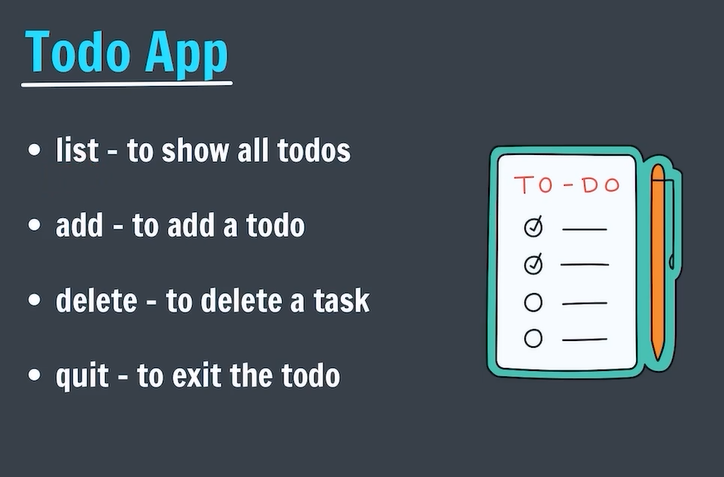 