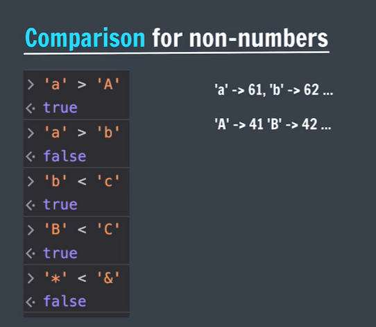

# JavaScript-apnaCollege

## Introduction
- **Console** uses REPL.
- <mark>REPL</mark> stands for Read-Evaluate-Print-Loop   
- **console.log()** used to print anything in console.   
- **Enter key** means return.   
- **Ctrl + L** to clear console. (ctrl + k) for mac    
  
## Variable  
**What is a <mark>Variable</mark>?**  
A variable is a simply the name of a storage location.   
  

## <mark>Data Types</mark> in JS

   

- **typeof()** returns the datatype of a variable/value.
```js
var a = 12;
var name = 'Shiv';
console.log(typeof a);
console.log(typeof name);
```

## Numbers in JS

- Positive (12) & Negative (-6).   
- Integers (45, -50)
- Floating numbers - with decimal (4.6, -8.9).

## Operations in JS

```js
a = 20
b = 10

//addition
sum = a + b

// subtraction
diff = a - b

// multiplication
prod = a * b

// division
div = a / b

// modulo
rem = a % b

// note : a and b are here operands and +, -, *, / is operators.These are binary operator.
```

- Modulo (remainder operator)   
      12 % 5 = 2   
- Exponentiation (power operator)    
      2**3 = 8

## NaN is JS

The NaN global property is a value representing <mark>Not-A-Number</mark>.   
- **typeof NaN** is a number.   
```js

    0/0 ==> NaN
    NaN - 1 ==> NaN
    NaN * 1 ==> NaN
    NaN + NaN ==> NaN

```

## Operator Precendence
This is the general <mark>order</mark> of solving an expression.

- ( )
- **
- *,/,%  left to right
- +, -   left to right

## let keyword
Syntax of declaring variables.  let comes in 2015
```js
Syntax :: let variableName = value;
let age = 23;
let name;
name = 'Shiv';
```

## const Keyword 

values of constants can't be changed with re-assignment & they can't be re-declared.   
```js
const year = 2023;
year = 2026; //(Error)
year = year + 1; //(Error)
const pi = 3.14;
const g = 9.8;
```

## var Keyword
Old syntax of writing variables
```js
    var age = 34;
```

## Comments
```js
    // comments
```

## Assignment Operators

=, +=, -=, *=, /=

## Unary Operators

- increment (++)  
  - Pre-increment (++x) {Change, then use}
  - Post-increment (x++) {Use, then change}
- decrement (--)
  - Pre-decrement (--x) {Change, then use}
  - Post-decrement (x--) {Use, then change}

## Identifier Rules
   

## camelCase
Way of writing identifiers

- camelCase (JS naming convention)
- snake_case
- PascalCase

## Boolean
Boolean represent a truth value -> true or false / yes or no

```js
  let age = 23;
  let isAdult = false;
```
## What is TypeScript?
Static Typed, where JS is dynamic typed.   
- Designed by Microsoft. 

## String
Strings are <mark>text</mark> or sequence of characters.

```js
  let name = 'Shiv Singh';
  let char = 'a';
  let num = '23';
  let empty = '';
  let ssentence = 'This is "apple"';
```

## String Indices
- index means position
```js
let name = 'SHIV SINGH';
S H I V _ S I N G H
_ _ _ _ _ _ _ _ _ _
0 1 2 3 4 5 6 7 8 9
name[0] -> 'S'
name[1] -> 'H'
it is called zero based indexing.
```
- to find the length of string we use .length property.

## Concatenation
Adding strings together.

```js
"tony" + " " + "stark" = "tony stark"
"tony" + 1 = "tony1"
```

## null & undefined in JS

**undefined**
A variable that has not been assigned a value is of type undefined.

```js
let a;
console.log(a); // undefined
```

## null 
The null value represents the intentional absence of any object value.    
To be explicitly assigned.

```js
  let a = null;
  console.log(a); // null
```

## console.log()
To write (log) a message on the console.

```js
  console.log('Just Coder');// Just Coder
  console.log(1234); // 1234
  console.log(2+2); // 4
  console.log('Just','Coder', 123); // Just Coder 123
```

## Linking JS File
```js
  <script src="app.js"></script>
```

## Template Literals
They are used to add embedded expressions in a string.
back tick (` ${exp}`)
```js
  let a = 5;
  let b = 10;
  console.log(`Your pay  ${a + b} rupees`);
  // console.log('Your pay', a + b, 'rupees')
```

## Operators in JS

- Arithmetic (+, -, *, /, %, **)  
- Unary (++, --)  
- Asssignment (=, +=, -=, *=, /=, %= etc.)   
- Comparison  (<, >, <=, >=, ==, !=, ===, !==)
- Logical  

## Comparison Operators
Comparison Operator to compare 2 values. It returns boolean value.
- <
- \>
- <=
- \>=
- ==
- !=
- ===
- !==

  
 

**Note :** have a look on JS unicode.

## Conditional Statements :
- if-else
- nested if-else
- switch

## if Statement 
```js
  // some code before if

  if(some condition){
  // Do something
  }
  // some code after if
```
```js
  console.log('Before my if statement');
let age = 21;
if(age >= 18){
    console.log('you can vote');
    console.log('you can drive');
}
console.log('after my if statement');
```

## else if Statement

```js
  if(condition1){
    //Do Something
  }else if(condition2){
    //Do Something
  }else if(condition3){
    //Do Something
  }else{
    //Do Something
  }
```

## Nested if-else

   